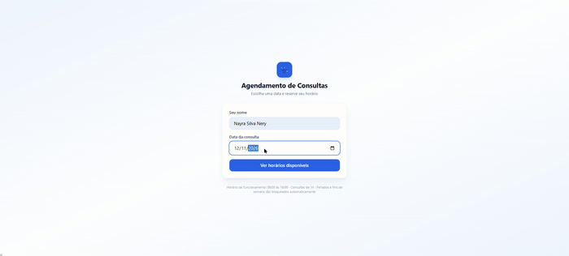

<p align="center">
  
</p>

# Agenda Clínica

[](https://github.com/NayraNery127/Agenda-clinica/actions/workflows/tests.yml)

Sistema de agendamento inteligente para clínicas — projeto pessoal desenvolvido para
praticar arquitetura full stack (React + Node.js + PostgreSQL) resolvendo um problema real.

<!-- Demo: substitua a linha abaixo pelo GIF depois de gravar (veja instruções no fim deste README) -->
<p align="center">
  
</p>

## Contexto

Uma clínica recebe dezenas de mensagens por dia no WhatsApp perguntando por horários
disponíveis. Este projeto substitui esse processo manual por um mini sistema web de
agendamento que já valida automaticamente feriados, finais de semana e horários ocupados.

## Arquitetura

```
Usuário escolhe data → Frontend chama backend → Backend consulta API de feriados
→ Backend valida (feriado / fim de semana / horário ocupado) → Retorna horários livres
→ Usuário escolhe → Backend salva no PostgreSQL
```

| Camada | Tecnologia | Por quê |
|---|---|---|
| Frontend | React + TypeScript + Vite | build rápido, tipagem ponta a ponta com o backend |
| Backend | Node.js + Express + TypeScript | API REST simples, mesma linguagem do frontend |
| Banco | PostgreSQL + Prisma | persistência real + ORM tipado, evita SQL manual |
| Feriados | [Nager.Date API](https://date.nager.at/api/v3/PublicHolidays/2026/BR) | fonte pública real, com cache em memória por ano |
| Testes | Jest | cobre a regra de negócio mais sensível a erro (cálculo de dia útil) |
| Deploy local | Docker Compose | sobe banco + backend com um único comando |

## Regras de negócio implementadas

- Funcionamento: 08:00 às 18:00, consultas de 1h (10 horários/dia).
- Bloqueia automaticamente: feriados nacionais (BR), finais de semana, horários já ocupados.
- Toda validação é refeita no **backend** ao criar o agendamento — o frontend nunca é a
  única barreira (regra clássica de segurança: nunca confiar só na validação do cliente).
- Concorrência: o banco tem uma constraint `UNIQUE(date, time)`, então mesmo que duas
  pessoas tentem marcar o mesmo horário ao mesmo tempo, só uma consegue.

## Endpoints

| Método | Rota | Descrição |
|---|---|---|
| `GET` | `/available?date=2026-02-10` | horários livres na data |
| `POST` | `/appointments` | cria agendamento (`{ patientName, date, time }`) |
| `GET` | `/appointments` | lista agendamentos (filtro opcional `?date=`) |

## Como rodar

### Com Docker (recomendado)

```bash
docker compose up --build
```

Backend sobe em `http://localhost:3333`, banco em `localhost:5432`.
Depois, rode as migrations uma vez:

```bash
docker compose exec backend npx prisma migrate deploy
```

### Frontend (local, fora do Docker)

```bash
cd frontend
npm install
npm run dev
```

### Testes

```bash
cd backend
npm install
npm test
```

## Estrutura do repositório

```
backend/
  src/
    routes/appointments.ts   # endpoints REST
    services/availability.ts # regra de negócio: cálculo de horários livres
    services/holidays.ts     # integração com a API de feriados
    __tests__/                # testes Jest
  prisma/schema.prisma        # modelo de dados
frontend/
  src/App.tsx                 # tela única de agendamento
docker-compose.yml
```

## Decisões de projeto (documentadas de propósito)

- **Datas como string (`YYYY-MM-DD`), não `Date`**: evita bugs de fuso horário entre
  frontend, backend e banco — problema clássico em sistemas de agendamento.
- **Cache de feriados em memória por ano**: evita bater na API pública a cada
  requisição de disponibilidade, sem precisar de um cache externo (Redis) para esse
  volume de dados.
- **Prisma em vez de SQL puro**: tipagem automática do schema até o código,
  reduz erro humano em queries.
