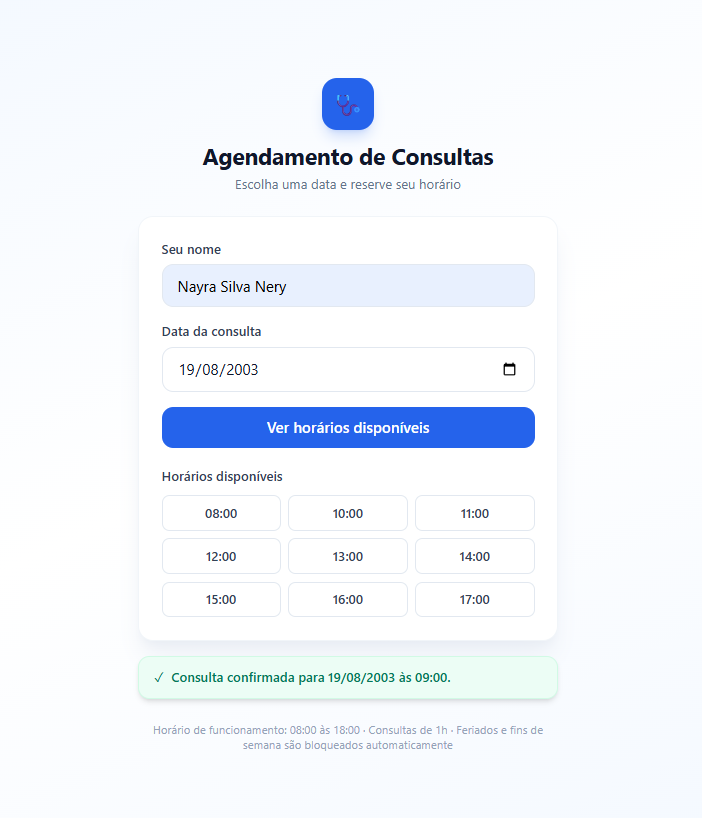
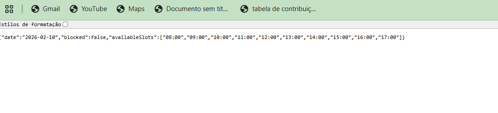
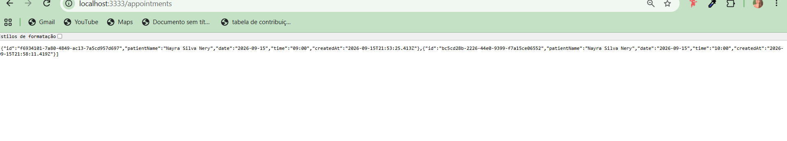

# 11. Evidências de Software

Capturas de tela do sistema funcionando de ponta a ponta, como prova de que os
requisitos documentados foram efetivamente implementados.

## Interface funcionando com validações

Fluxo completo: nome informado, data escolhida, horários disponíveis exibidos, e
confirmação de agendamento com feedback visual imediato.

## Backend retornando horários disponíveis

Resposta real da API (`GET /available?date=...`), confirmando que a lógica de
cálculo de horários livres funciona de ponta a ponta, incluindo a consulta à API
pública de feriados.

## Agendamentos persistidos no banco de dados

Resposta real da API (`GET /appointments`), confirmando que os agendamentos criados
pela interface são efetivamente salvos no PostgreSQL, com data, horário e nome do
paciente corretos.

